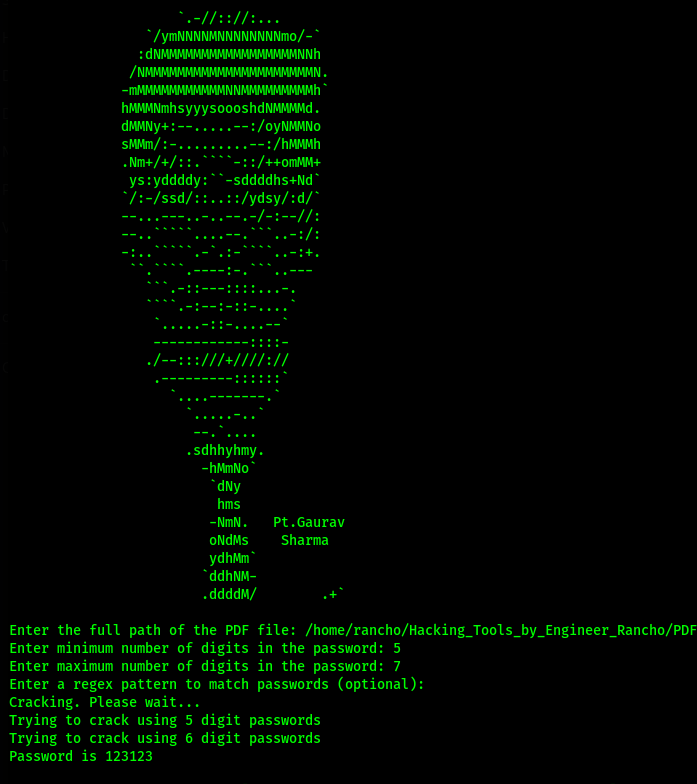
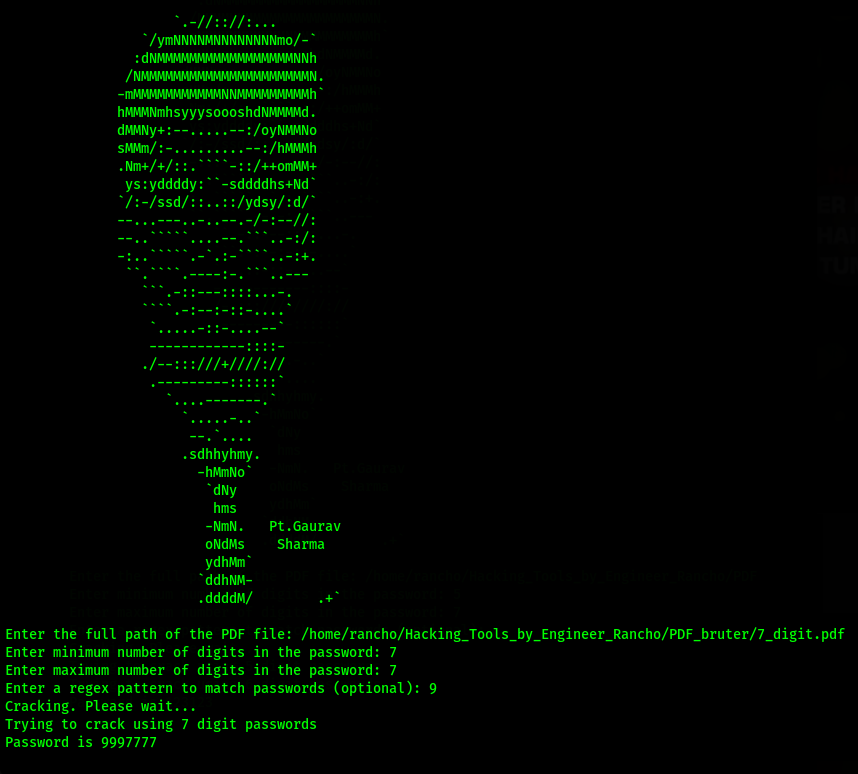
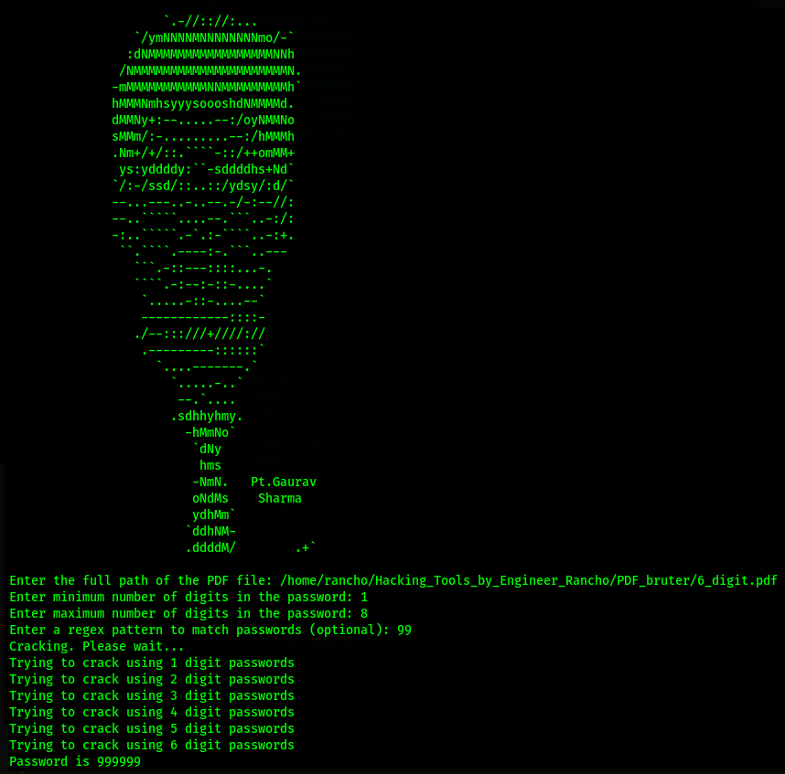

# PDF_bruter
A Numeric PDF bruter, this tool is able to find the Passwords of the protected PDFs
### Bruteforce PDFs protected with numeric passwords

This tool helps to find the Password of the PDF irrespective of length that a password contains but take a little more instead

### commnds to clone into PDF Bruter
```
git clone https://github.com/EngineerRancho/PDF_bruter

cd PDF_bruter

python bruter.py
```
### Drop Your ★★★★★

 

### 1 digit of probable pattern



### 2 digit of probable pattern



